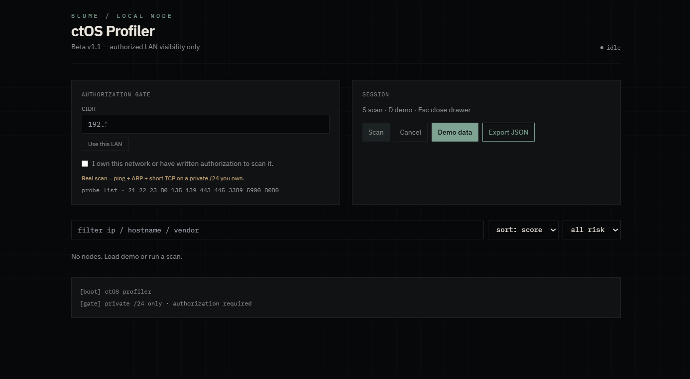
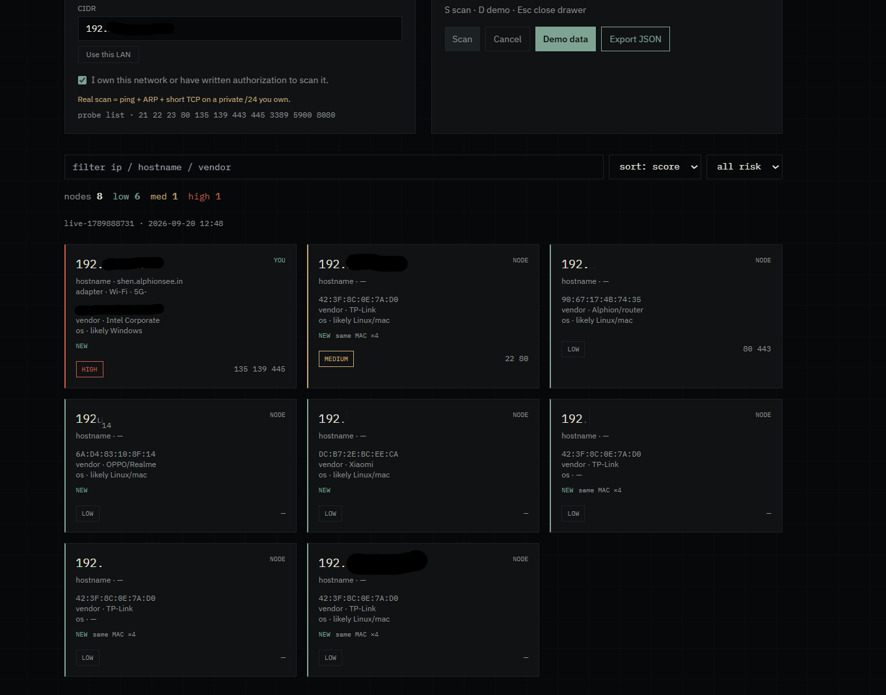

  
  <h1>ctOS Profiler(demo)</h1>
  
Local authorized LAN visibility tool. <b>Localhost only.</b>

  

 

  
<b>Ethical Use Disclaimer( -_•)</b>

   
  

    <b>Demo first. Real scans ONLY on networks you own or have written permission to test.</b> 
    Educational / authorized local analysis only. Unauthorized scanning is illegal. 
    ദ്ദി◝ ⩊ ◜.ᐟ
  

 
<h3>★ About </h3>
<b>ctOS Profiler</b> is a localhost Watch Dogs–style profiler.
Start in demo mode, then scan a private /24 you actually own.
Ping + ARP + a short TCP list. No Nmap engine. No packet capture. No exploits.

<h3>★ Features </h3>
✦ <b>Localhost only</b> — binds to 127.0.0.1:8787 
✦ <b>Demo mode first</b> — fake hosts before anything live 
✦ <b>Auth gate</b> — checkbox + private /24 cap (public ranges rejected) 
✦ <b>Live grid</b> — vendor, ports, low/med/high badge, profile drawer 
✦ <b>Export JSON</b> — last scan as a file 
✦ <b>/docs</b> — FastAPI OpenAPI for the scan body
<h3>★ Built With</h3>

  

<h3>★ How to Run </h3>
Windows:
<pre>
git clone https://github.com/ningshenball/ctos-profiler.git
cd ctos-profiler
python -m venv .venv
.\.venv\Scripts\Activate.ps1
pip install -r requirements.txt
python app.py
</pre>
Open http://127.0.0.1:8787 and http://127.0.0.1:8787/docs 
Use this LAN fills the CIDR from your current private IPv4. Check the authorization box before a live scan. 
<code>data/last-*.json</code> is a local snapshot only. It is gitignored and not committed.
 
Linux / mac:
<pre>
python -m venv .venv
source .venv/bin/activate
pip install -r requirements.txt
python app.py
</pre>
<h3>★ Tests</h3>
<pre>
python -m pytest test -q
</pre>
